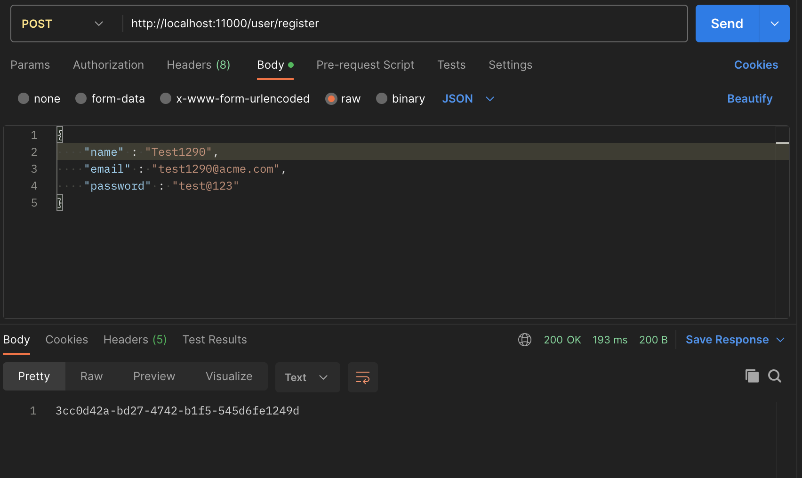
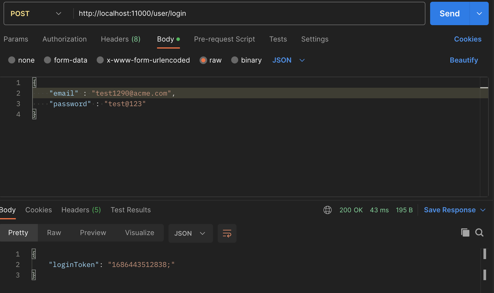
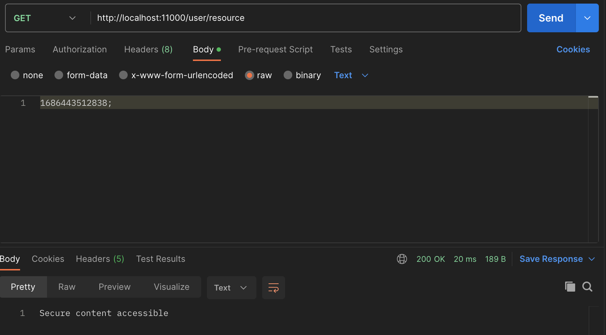
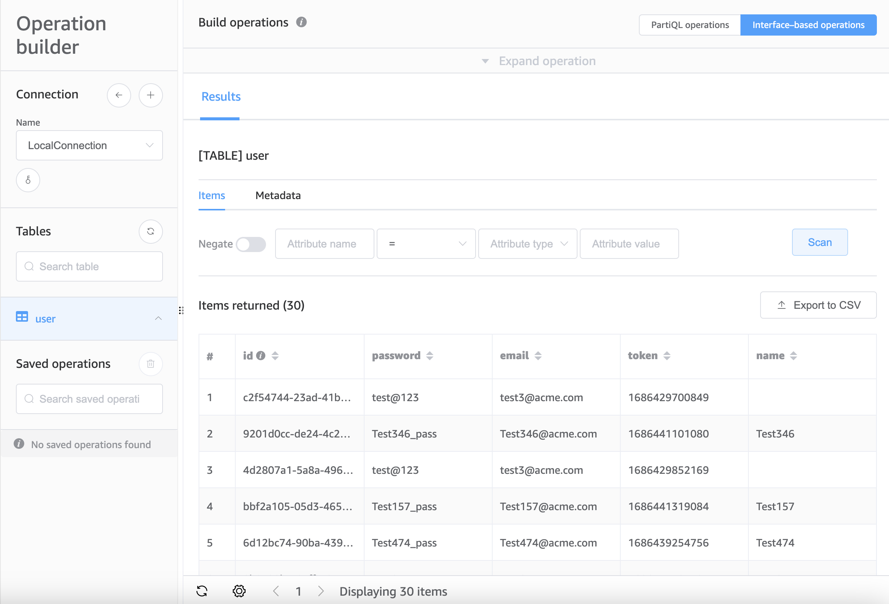

# Endpoints in the microservice
## Registration Endpoint (POST /user/register)
* Registers a new user with name, email and password as input
* Returns the id (primary key) of the user just created


## Login Endpoint (POST /user/login)
* Logs in a user
* Returns a token after successful login
* Returns error message for invalid user (not registered user)


## Resource Endpoint (GET /user/resource)
* Takes token returned from login endpoint as input
* Validates the token with the existing users
* Returns accessible content on successful token validation
* Returns error message on failed token validation


# Tech Stack for the Microservice

## Spring-Boot
* Controller, Service layers and Models defined in Spring-Boot
* DynamoDB integrated with Spring-Boot

## DynamoDB  
* DynamoDB is run locally with docker
    * docker command : ```docker run -p 8000:8000 amazon/dynamodb-local -jar DynamoDBLocal.jar -inMemory -sharedDb```
* Contents in DynamoDB


## Tests
* TestNg Framework
* RestAssured for API client
* AmazonDynamoDB client for database validations

## Scenarios
* Registration of new user
* Login with valid user (registered user)
* Login with invalid user (unregistered user)
* Accessing the protected resource with login token

## Implementation
* All tests are idempotent
* All tests don't assume existence of data
* All tests create their own data
* Clearing data after test not implemented

